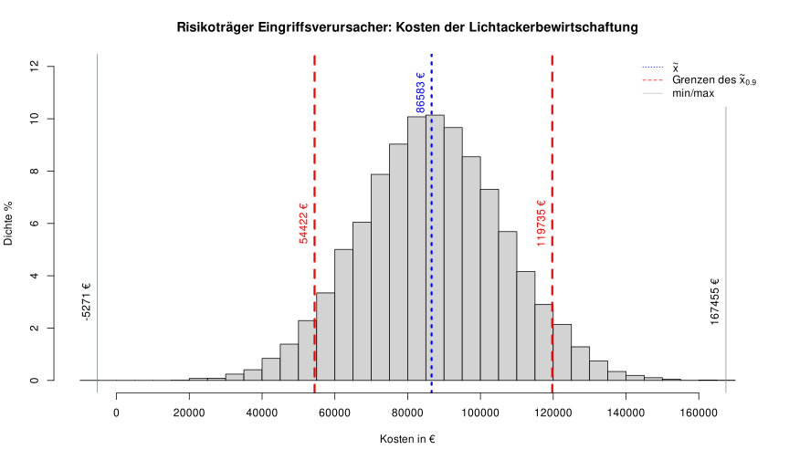
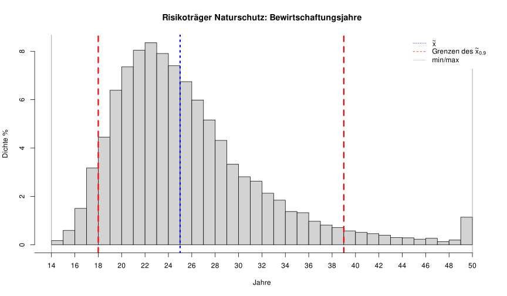
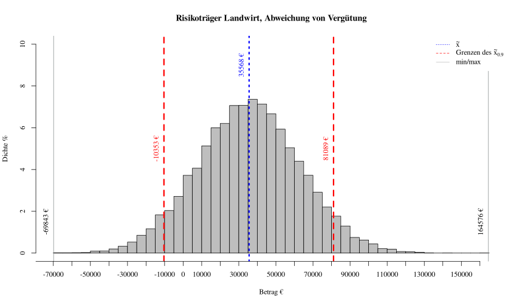

# Lichtacker-Risiko-Kalkulation

Dargestellt ist die Risikokalkulation von einer produktionsintegrierten Kompensation eines "Lichtackers". Diese war Teil einer Seminararbeit im Fach Nachhaltige Landnutzung (Landschaftsökonomie) im Bachelor Landschaftsökologie und Naturschutz an der Universität Greifsald. Berechnungen wurden mit Hilfe einer Zeitreihenanalyse von Zinssätzen und variablen Kosten, Ertrag und Marktpreis von Weizen, Gerste, Hafer und Raps durchgeführt. In dieser Monte-Carlo-Simulation wurden die ARIMA-Modelle verwendet. Für eine genaue Beschreibung der Vorgehensweise siehe die  .

### Datenquellen

Sauer, Norbert und Bernd Hardeweg (2006). Standarddeckungsbeiträge (SDB): Kalkulation der
Rechenwerte zur Betriebsklassifizierung nach der EU-Typologie. Hrsg. von Kuratorium für
Technik und Bauwesen in der Landwirtschaft e.V. Darmstadt. URL : https://daten.ktbl.de/sdb/pdf/SDB_Methode.pdf.

Gesamtverband der Deutschen Versicherungswirtschaft e.V.(2018). Entwicklung des durchschnittlichen Zinssatzes für Spareinlagen (Sparbuchzinsen) in Deutschland in den Jahren
1975 bis 2017“. In: Statistisches Taschenbuch der Versicherungswirtschaft. ISSN:0936-1960.

## Risiko für den Eingrissverursacher

## Risiko für den Naturschutz

## Risiko für den Landwirt

